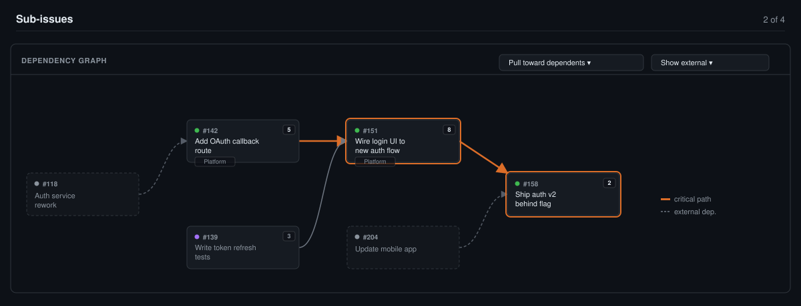
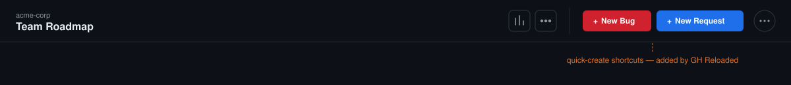
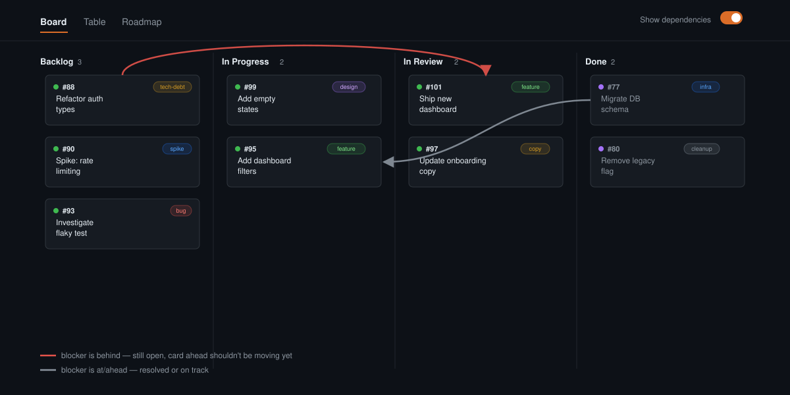
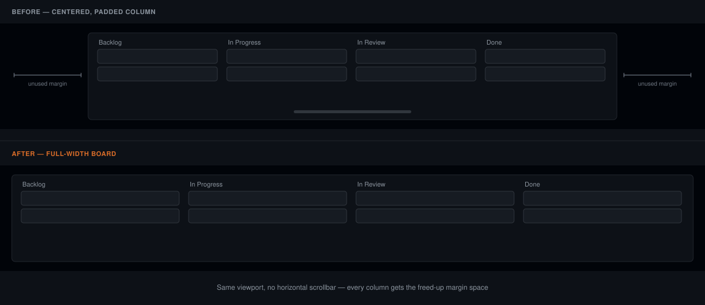

<p align="center">
  
</p>

<h1 align="center">GH Reloaded</h1>

<p align="center">
  <a href="LICENSE"></a>
  
  
  <a href="CONTRIBUTING.md"></a>
</p>

<p align="center">
A Chrome extension that injects small, focused UI enhancements into github.com, aimed at making GitHub itself more pleasant to use.
</p>

It's a collection of independent features, not a single-purpose tool: each one lives in its own folder under `features/` and can be added, removed, or shipped on its own. GitHub covers the fundamentals well; this is for the gaps that are easier to fill from the outside than to wait on.

## Install (unpacked, for now)

This isn't on the Chrome Web Store yet.

### 1. Load the extension

1. Clone this repo.
2. Open `chrome://extensions`, enable **Developer mode** (top-right toggle).
3. Click **Load unpacked** → select the repo folder.
4. Open **Settings**: click the extension's toolbar icon, or from `chrome://extensions` → the extension's card → **Details** → **Extension options**.

### 2. Create a GitHub token

Go to [github.com/settings/personal-access-tokens/new](https://github.com/settings/personal-access-tokens/new) (a **fine-grained** token, not classic) and set:

- **Repository access** → *Only select repositories* → pick the repo(s) you want this on.
- **Permissions** → **Repository permissions** → set both of these to **Read-only**:
  - **Issues** — sub-issues, dependencies, org-level custom fields (Team / Business Value / Effort)
  - **Projects** — Projects v2 Status
- Everything else stays at *No access*.
- Click **Generate token** and copy it immediately — GitHub shows it exactly once.

If the repo belongs to an organization with SSO enforced (or with a policy restricting personal access tokens), one more step: go to [github.com/settings/tokens](https://github.com/settings/tokens), find the new token, and click **Configure SSO** / **Authorize** next to the org's name. Without this, requests to that org's data can silently come back empty or `404`, since GitHub doesn't otherwise reveal that the resource exists.

### 3. Connect it

Back in the extension's Settings page: paste the token, **Save**, then **Test connection** — it should report the GitHub username the token authenticates as.

## Features

_Screenshots below are mockups illustrating each feature's layout and colors (matched to the extension's actual dark-theme CSS) — not literal captures of a live GitHub page._

### Dependency graph — [features/dependency-graph](features/dependency-graph)

On a GitHub issue page (or a Projects board's issue-preview side panel) that has sub-issues, injects a left-to-right dependency graph below the sub-issues list.



- Fetches the issue's direct sub-issues, their "blocked by" / "blocking" relationships, Projects v2 Status, and the org-level Team / Business Value / Effort custom fields (when available).
- Lays the graph out left → right, colored by each card's real board status, with dependencies outside the sub-issue set shown as dimmed, dashed "external" nodes.
- Highlights the critical path (longest chain by total Effort — unestimated stories are assumed to cost the median of whatever else in the feature is sized, so a couple of missing estimates don't distort it) and lets you toggle how much of that external context to show, and how columns are aligned.

### Quick-create button — [features/quick-create](features/quick-create)

A small floating button (or stack of buttons) on a GitHub Projects board view, each linking straight to "new issue" for a repo you configure in Settings — handy when the repo you actually file work into isn't the one the board itself lives in. Fully user-defined (label, URL, color, and an optional "only on this board" project match); nothing is preset.



### Board dependency arrows — [features/board-dependencies](features/board-dependencies)

On a GitHub Projects **Board** (kanban) view, draws an arrow directly between any two currently-visible cards where one blocks the other — red if the blocker is behind the card it blocks, gray otherwise — no need to open either issue to see the dependency. Off by default; a switch next to the view tabs (shown only while a Board view is selected) turns it on, and the choice is remembered (also switchable from Settings).



### Full-width board — [features/full-width-board](features/full-width-board)

On a GitHub Projects **Board** (kanban) view, stretches the board to the full window width instead of the page's normal centered column — more room for columns before they need to scroll horizontally. On by default; switchable from Settings.



More features will land as their own entries here, each in its own folder under `features/` (and `background/` for anything they need server-side). See [Contributing](#contributing) for the shape a new one takes.

## Project layout

```
manifest.json                       MV3 manifest — wires content scripts and the background service worker
background.js                       Service worker entry point: opens Settings, routes messages to feature modules
lib/github-api.js                   Shared GitHub REST/GraphQL client (auth, caching) used by every feature
background/<feature>.js             One feature's server-side logic (GitHub calls, computation) + its MESSAGE_TYPE
features/<feature>/                 One feature's content-script side: DOM injection, rendering, styling
options/                             Settings page (GitHub token, quick-create shortcuts, feature toggles)
icons/                               Toolbar/extensions-page icons
```

## Releasing

A push to `main` that bumps `manifest.json`'s `"version"` field is packaged and released automatically by [`.github/workflows/release-chrome-extension.yml`](.github/workflows/release-chrome-extension.yml):

1. Zips `manifest.json`, `background.js`, `background/`, `features/`, `icons/`, `lib/`, and `options/` into `gh-reloaded-<version>.zip`.
2. Uploads and publishes that zip to the Chrome Web Store, if the store secrets below are configured.
3. Attaches the zip to a GitHub Release tagged `v<version>`, either way.

A push that doesn't change the version is a no-op for this workflow — the Chrome Web Store refuses to re-accept a version it already has, so re-submitting unchanged would just fail every time.

### Requiring a version bump on every PR

[`.github/workflows/require-version-bump.yml`](.github/workflows/require-version-bump.yml) runs on every pull request into `main` and fails if `manifest.json`'s `"version"` isn't strictly higher than what's currently on `main` — so a feature branch needs its version bump before opening (or before merging) a PR.

By itself this only shows as a pass/fail check on the PR; to actually block the merge button, mark it **required**:

1. Repo → **Settings → Branches** (or **Rules → Rulesets**) → add/edit a protection rule for `main`.
2. Enable **Require status checks to pass before merging**.
3. Add **`Require Version Bump / check-version`** to the required list (it only appears in the picker after the workflow has run at least once on a PR).

This repo's own settings aren't something this workflow file can change — it needs to be turned on by a repo admin from the GitHub UI (or via the API) the same way any other required check would be.

### One-time store setup

The API can only update an *existing* Chrome Web Store listing — the first submission has to happen by hand:

1. Pay the one-time $5 registration fee and create a [Chrome Web Store Developer Dashboard](https://chrome.google.com/webstore/devconsole) account.
2. Package the extension (`zip -r extension.zip manifest.json background.js background features icons lib options`), upload it as a new item, fill in the store listing (description, screenshots, privacy practices, single purpose, permission justifications), and submit it for review.
3. Once it's accepted, note the **Extension ID** (from the dashboard item URL) and your **Publisher ID** (Dashboard → account settings → *Publisher (developer) account*).
4. In Google Cloud Console, create an OAuth client (APIs & Services → Credentials → *OAuth client ID* → type "Desktop app") and enable the **Chrome Web Store API** on that project.
5. Generate a refresh token for that client, authorized for the `https://www.googleapis.com/auth/chromewebstore` scope against your Web Store account — e.g. via [`chrome-webstore-upload-cli`](https://github.com/fregante/chrome-webstore-upload-cli)'s docs, or any OAuth 2.0 installed-app flow.
6. Add these as **Actions secrets** (repo Settings → Secrets and variables → Actions):

   | Secret | Value |
   |---|---|
   | `CHROME_EXTENSION_ID` | Extension ID from step 3 |
   | `CHROME_PUBLISHER_ID` | Publisher ID from step 3 |
   | `CHROME_CLIENT_ID` | OAuth client ID from step 4 |
   | `CHROME_CLIENT_SECRET` | OAuth client secret from step 4 |
   | `CHROME_REFRESH_TOKEN` | Refresh token from step 5 |

Until all five secrets are set, the workflow still cuts a GitHub Release on every version bump; it just skips the store upload step (with a warning in the run log) rather than failing the run.

Google's own review queue still sits on top of this either way — a workflow run "publishing" a release means it was *submitted*, not that it's instantly live on the store.

## Contributing

See [CONTRIBUTING.md](CONTRIBUTING.md) for how a feature module is structured and how to add a new one. Issues and PRs welcome.

## License

[MIT](LICENSE)
