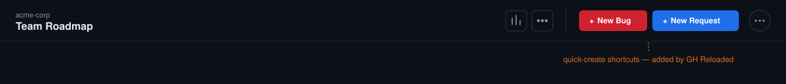
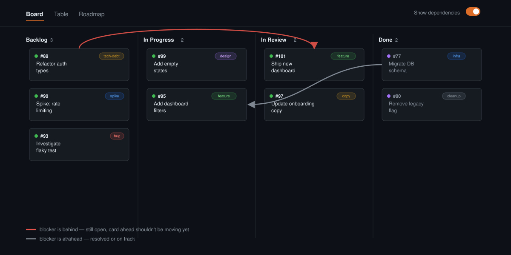
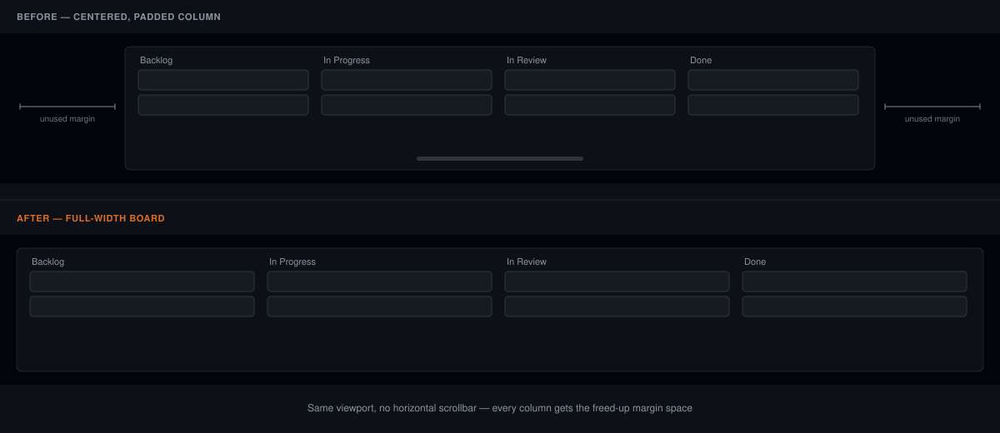
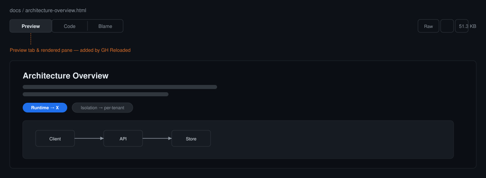
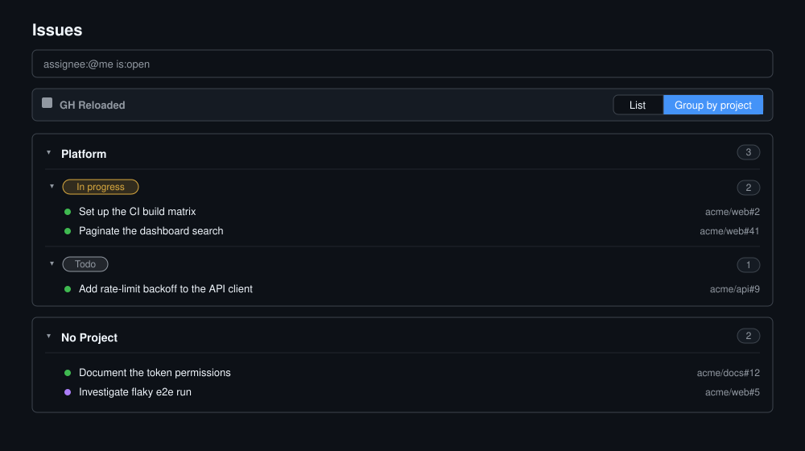

<p align="center">
  
</p>

<h1 align="center">GH Reloaded</h1>

<p align="center">
  <a href="https://gh-reloaded.simone3-cattani.chatgpt.site/">Website</a> ·
  <a href="LICENSE">License</a> ·
  <a href="CONTRIBUTING.md">Contributing</a>
</p>

<p align="center">
  <a href="LICENSE"></a>
  
  
  <a href="CONTRIBUTING.md"></a>
</p>

<p align="center">
A Chrome extension that injects small, focused UI enhancements into github.com, aimed at making GitHub itself more pleasant to use.
</p>

It's a collection of independent features, not a single-purpose tool: each one lives in its own folder under `features/` and can be added, removed, or shipped on its own. GitHub covers the fundamentals well; this is for the gaps that are easier to fill from the outside than to wait on.

## Install (unpacked, for now)

This isn't on the Chrome Web Store yet.

### 1. Load the extension

1. Clone this repo.
2. Open `chrome://extensions`, enable **Developer mode** (top-right toggle).
3. Click **Load unpacked** → select the repo folder.
4. Open **Settings**: click the extension's toolbar icon, or from `chrome://extensions` → the extension's card → **Details** → **Extension options**.

### 2. Create a GitHub token

Go to [github.com/settings/personal-access-tokens/new](https://github.com/settings/personal-access-tokens/new) (a **fine-grained** token, not classic) and set:

- **Repository access** → *Only select repositories* → pick the repo(s) you want this on.
- **Permissions** → **Repository permissions** → set these to **Read-only**:
  - **Issues** — sub-issues, dependencies, org-level custom fields (Team / Business Value / Effort)
  - **Projects** — Projects v2 Status
  - **Contents** — reading HTML files for the **HTML preview** feature; only needed for private repos, public ones work without a token
- Everything else stays at *No access*.
- Click **Generate token** and copy it immediately — GitHub shows it exactly once.

If the repo belongs to an organization with SSO enforced (or with a policy restricting personal access tokens), one more step: go to [github.com/settings/tokens](https://github.com/settings/tokens), find the new token, and click **Configure SSO** / **Authorize** next to the org's name. Without this, requests to that org's data can silently come back empty or `404`, since GitHub doesn't otherwise reveal that the resource exists.

### 3. Connect it

Back in the extension's Settings page, under **GitHub tokens**: paste the token into **Default token**, **Save tokens**, then **Test** — it should report the GitHub username the token authenticates as.

Working across several repository owners — organizations or personal accounts — that need their own token (a different fine-grained token, or one authorized for an organization's SSO)? **Add owner token** for each, with that owner's login (a pasted `https://github.com/<owner>` works too). A request always uses the token of the repository's owner, falling back to the default token — never by trying every saved token in turn; with no default set, owners without a token of their own are read anonymously. Saved tokens are never shown again in full, only by their last 4 characters.

## Features

_Screenshots below are mockups illustrating each feature's layout and colors (matched to the extension's actual dark-theme CSS) — not literal captures of a live GitHub page._

### Dependency graph — [features/dependency-graph](features/dependency-graph)

On a GitHub issue page (or a Projects board's issue-preview side panel) that has sub-issues, injects a left-to-right dependency graph below the sub-issues list.


- Fetches the issue's direct sub-issues, their "blocked by" / "blocking" relationships, Projects v2 Status, and the org-level Team / Business Value / Effort custom fields (when available).
- Lays the graph out left → right, colored by each card's real board status, with dependencies outside the sub-issue set shown as dimmed, dashed "external" nodes on a plain surface (their Status shows in the border and dot, not as a tinted fill).
- Highlights the critical path (longest chain by total Effort — unestimated stories are assumed to cost the median of whatever else in the feature is sized, so a couple of missing estimates don't distort it) and lets you toggle how much of that external context to show, how columns are aligned, and whether to hide transitive dependencies (edges already implied by a longer chain, at any depth — hidden by default, uncheck to see every explicit dependency). Click a card (or focus it with Tab and press Enter or Space) to fade everything except its upstream and downstream (click it again, click the background or press Escape to clear).
- A full-screen control opens the same graph viewport-sized, with larger cards (showing Status and Team as well as the color fill), a header with the graphed issue's title and metadata (Status, Business Value, Effort, Team), and more room for long chains; close it with its button or Escape, without reloading the page or losing the current view.
- A refresh control rebuilds the graph in the background — and does so periodically on its own (about once a minute), so adding a sub-issue or a dependency shows up without reloading the page; returning to a tab refreshes it right away. The current graph stays visible until the new one is ready, a failed refresh keeps the last graph with a retry button, and automatic refreshing pauses while the tab is hidden and backs off when a refresh fails (hardest when GitHub signals a rate limit) so steady-state polling stays within GitHub's API quota.

### Quick-create button — [features/quick-create](features/quick-create)

A small floating button (or stack of buttons) on a GitHub Projects board view, each linking straight to "new issue" for a repo you configure in Settings — handy when the repo you actually file work into isn't the one the board itself lives in. Fully user-defined (label, URL, color, and an optional "only on this board" project match); nothing is preset.



### Board dependency arrows — [features/board-dependencies](features/board-dependencies)

On a GitHub Projects **Board** (kanban) view, draws an arrow directly between any two currently-visible cards where one blocks the other — red if the blocker is behind the card it blocks, gray otherwise — no need to open either issue to see the dependency. Off by default; a switch next to the view tabs (shown only while a Board view is selected) turns it on, and the choice is remembered (also switchable from Settings).



### Full-width board — [features/full-width-board](features/full-width-board)

On a GitHub Projects **Board** (kanban) view, uses the full window width and makes every column flexible: columns grow into spare space, then shrink as needed (down to 140px each) so more of the board stays visible before horizontal scrolling is necessary. Boards with too many columns to fit at that minimum still scroll. On by default; switchable from Settings.



### HTML preview — [features/html-preview](features/html-preview) — _Experimental_

Renders `.html`/`.htm` files instead of leaving them as plain source.

- On a pull request's **Files changed** tab, adds a globe button next to each HTML file's "..." menu that opens the rendered file in a new tab.
- On a file's own page, adds a **Preview** tab next to Code/Blame that renders it inline — the same way GitHub already does for Markdown.



Fetches the file's content through the GitHub API at the exact commit/branch shown (working out the right split itself even when a branch name contains a slash, e.g. `feature/x`), then renders it through two nested, sandboxed layers: an extension page with its own CSP, itself embedding a manifest-declared *sandbox page* whose separate, permissive-by-default CSP is where the previewed file's HTML actually lands. That inner page can run scripts and load resources the way a normal webpage would (inline `<script>`, CDN'd libraries, fonts, images) while still having no access to your GitHub session, cookies, or any extension API — that isolation, not CSP strictness, is what keeps it safe. Works without a token for public repos; a token with **Contents: Read-only** is needed for private ones. On by default.

Marked experimental: it renders arbitrary third-party HTML/JS, and the inline Preview tab anchors on GitHub's own (undocumented, redesign-prone) blob-page markup to inject itself — expect it to need upkeep as GitHub's UI changes.

### My Issues by project — [features/my-issues](features/my-issues)

On GitHub's own **My Issues** dashboard (`github.com/issues`), adds a "Group by project" control next to the native flat list. Switched on, it reorganizes the same issues as **Project → Status → issues** — collapsible groups with counts — so work spread across several Projects is readable at a glance; switched off, GitHub's own list is restored untouched. On by default (the control appears, the native list stays selected until you pick the grouped view).



- Runs the dashboard's **current search** through the API and groups the **complete, paginated** result set — not just the rows the dashboard happens to have rendered. The native search box, filters, and saved views stay in place: changing any of them updates the groups to match.
- Uses each Project's **real Status options and their board order** — no invented global columns. An issue in several Projects shows under each with the status it has **in that Project**; one assigned to none falls into an explicit **No Project** group, and one in a Project with no status into **No Status**.
- Read-only: it only links out to issues, and never changes an issue or a Project item. Needs a token with **Projects: Read-only** (plus repository read for private repos) to see project memberships; without it, issues still list under "No Project". Loading, empty, missing-token, and API-error states are shown explicitly, and a result set larger than the fetch cap is labelled "showing the first N of M" rather than presented as complete.

More features will land as their own entries here, each in its own folder under `features/` (and `background/` for anything they need server-side). See [Contributing](#contributing) for the shape a new one takes.

## Project layout

```
manifest.json                       MV3 manifest — wires content scripts and the background service worker
background.js                       Service worker entry point: opens Settings, routes messages to feature modules
lib/github-api.js                   Shared GitHub REST/GraphQL client (auth, caching) used by every feature
background/<feature>.js             One feature's server-side logic (GitHub calls, computation) + its MESSAGE_TYPE
features/<feature>/                 One feature's content-script side: DOM injection, rendering, styling
options/                             Settings page (GitHub tokens, quick-create shortcuts, feature toggles)
icons/                               Toolbar/extensions-page icons
```

## Releasing

Versioning and releases are automated with [Release Please](https://github.com/googleapis/release-please), driven by [`.github/workflows/release.yml`](.github/workflows/release.yml). Regular pull requests never touch `manifest.json`'s `"version"`; a bot owns the version number, which is a release decision rather than something each change picks.

The flow:

1. PR titles are [Conventional Commits](https://www.conventionalcommits.org/) (`feat:`, `fix:`, `docs:`, …), enforced on every PR by [`.github/workflows/pr-title.yml`](.github/workflows/pr-title.yml). PRs are squash-merged with the title as the commit message, so each PR becomes one conventional commit on `main`.
2. On each push to `main`, Release Please reads those commits and keeps a single **release PR** open that bumps `manifest.json` (and the `version.txt` it maintains) and updates `CHANGELOG.md`. A `feat` bumps the minor version, a `fix` the patch version; pre-1.0, a `feat` still bumps the minor.
3. Merging that release PR creates the `vX.Y.Z` tag and the GitHub Release, then the publish job packages the extension, uploads it to the Chrome Web Store (if the store secrets below are configured), and attaches `gh-reloaded-<version>.zip` to the release.

The zip bundles `manifest.json`, `background.js`, `background/`, `features/`, `icons/`, `lib/`, and `options/` — the same explicit path list as before, so neither `version.txt` nor the test harness ships.

### Repository settings (one-time, admin)

Release Please needs two repo settings that a workflow file can't set itself:

- **Settings → General → Pull Requests**: allow only **squash merging**, with the default commit message set to **Pull request title**.
- **Settings → Actions → General → Workflow permissions**: enable **Allow GitHub Actions to create and approve pull requests** — without it the bot can't open the release PR.
- **Settings → Branches → branch protection for `main`**: if a `Require Version Bump / check-version` required status check was added under the old manual-bump flow, remove it. This PR deletes that workflow, so the check can never report again and would otherwise block every PR — including the bot's release PR — forever.

The release PR is opened by `github-actions[bot]` with the built-in `GITHUB_TOKEN`. By GitHub's design, PRs and tags created with that token don't trigger other workflows, so CI doesn't run on the release PR; that's fine while no checks are required on `main`. If required checks are added later, switch Release Please to a repository-owned GitHub App token (see the issue's "Later ideas").

### One-time store setup

The API can only update an *existing* Chrome Web Store listing — the first submission has to happen by hand:

1. Pay the one-time $5 registration fee and create a [Chrome Web Store Developer Dashboard](https://chrome.google.com/webstore/devconsole) account.
2. Package the extension (`zip -r extension.zip manifest.json background.js background features icons lib options`), upload it as a new item, fill in the store listing (description, screenshots, privacy practices, single purpose, permission justifications), and submit it for review.
3. Once it's accepted, note the **Extension ID** (from the dashboard item URL) and your **Publisher ID** (Dashboard → account settings → *Publisher (developer) account*).
4. In Google Cloud Console, create an OAuth client (APIs & Services → Credentials → *OAuth client ID*; the refresh-token helper redirects to a random local port, so a "Web application" client needs that `http://127.0.0.1:<port>` redirect URI added first, while a "Desktop app" client accepts it as is) and enable the **Chrome Web Store API** on that project.
5. Generate a refresh token for that client, authorized for the `https://www.googleapis.com/auth/chromewebstore` scope against your Web Store account — e.g. via [`chrome-webstore-upload-cli`](https://github.com/fregante/chrome-webstore-upload-cli)'s docs, or any OAuth 2.0 installed-app flow.
6. Create an environment named `chrome-web-store` (repo Settings → Environments), restrict its deployment branches to `main`, and add these as **environment secrets** — not repository secrets, so that a workflow run from any other branch cannot read them:

   | Secret | Value |
   |---|---|
   | `CHROME_EXTENSION_ID` | Extension ID from step 3 |
   | `CHROME_PUBLISHER_ID` | Publisher ID from step 3 |
   | `CHROME_CLIENT_ID` | OAuth client ID from step 4 |
   | `CHROME_CLIENT_SECRET` | OAuth client secret from step 4 |
   | `CHROME_REFRESH_TOKEN` | Refresh token from step 5 |

The refresh token expires after 7 days while the Google OAuth app is in "Testing" status: publish the app (Google Auth Platform → Audience → *Publish app*) so it does not. To recover a failed publish, run the **Release** workflow manually with the tag to publish (e.g. `v0.7.0`).

Until all five secrets are set, the workflow still cuts a GitHub Release on every version bump; it just skips the store upload step (with a warning in the run log) rather than failing the run.

Google's own review queue still sits on top of this either way — a workflow run "publishing" a release means it was *submitted*, not that it's instantly live on the store.

## Contributing

Start with [CONTRIBUTING.md](CONTRIBUTING.md). The full conventions — the shape of a feature, the design rules, how docs stay in sync, the definition of done, and the git/PR workflow — live in [AGENTS.md](AGENTS.md), which both people and coding assistants read. Issues and PRs welcome.

## Privacy

See [PRIVACY.md](PRIVACY.md) — short version: nothing is collected, sold, or sent anywhere except directly to `api.github.com` with your own token.

## License

[MIT](LICENSE)
