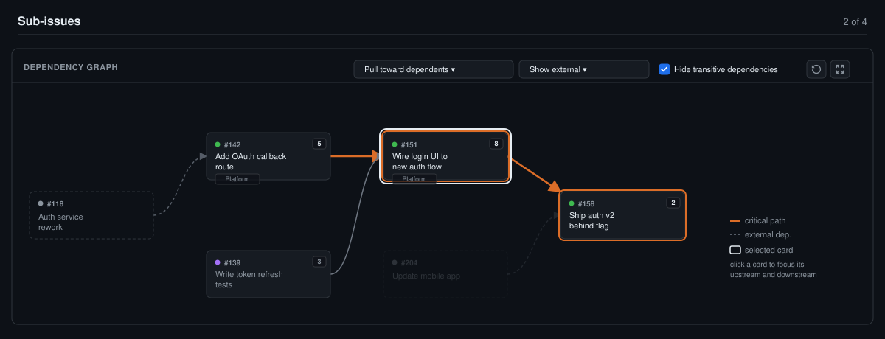

# Dependency graph

Injects a left-to-right dependency graph below the "Sub-issues" section on a GitHub issue page, and inside a GitHub Projects board's issue-preview side panel.

_Mockup illustrating the layout and colors — not a literal screenshot._

## What it does

- Fetches the issue's direct sub-issues (REST), and for each one its "blocked by" / "blocking" relationships ([Issue Dependencies](https://github.blog/changelog/2025-08-21-dependencies-on-issues/), REST), Projects v2 Status (GraphQL), and the org-level Team / Business Value / Effort custom fields (REST), when available.
- Lays out left → right: a blocker always renders strictly left of what it blocks. Columns default to pulling a node as close as possible to its nearest dependent ("place a card right before what it blocks"); a dropdown switches to plain as-early-as-possible. Within a column, more-connected nodes float to the top.
- Cards fill with the field's real configured color — no hardcoded mapping of a status name to a color; whatever the board says is what renders.
- Dependencies outside the direct sub-issue set render as dimmed, dashed "external" nodes/edges on a plain surface (Status shows in the border and dot rather than a tinted fill), with a dropdown to hide resolved ones or hide external dependencies entirely.
- Highlights the critical path: the longest chain by total Effort, ignoring closed (done) sub-issues, with the tie-break falling back to path length when effort ties (including when nothing is estimated at all) and an unestimated story assumed to cost the median of whatever else in the feature is sized.
- A link icon (not the whole card) navigates to the issue, so the card itself stays free for future interaction.
- A full-screen control opens the same graph in a viewport-sized overlay with larger, more informative cards (they spell out the board Status and Team as well as the color fill), wider spacing, and a header with the graphed issue's title and metadata (Status, Business Value, Effort, Team), for inspecting long or complex chains; close it with its button or the Escape key. Entering and leaving full-screen reuses the already-loaded graph, so it never reloads the page or loses the current state.
- A refresh control (in both the embedded and full-screen views) rebuilds the graph from GitHub, and it also refreshes itself periodically so a newly added sub-issue or dependency shows up without a page reload. The rebuild happens in the background: the current graph stays visible and interactive and is swapped in one step only once the new one is ready, and a failed refresh keeps the last graph on screen with a retry button rather than replacing it with an error. Automatic refreshing bypasses the shared API cache so it sees new data, pauses while the tab is hidden, and never overlaps an in-flight rebuild; its interval defaults to 15s and can be tuned with the `ghdgAutoRefreshMs` value in `chrome.storage.local`.

## Known limitations

- Only direct sub-issues become full "internal" nodes — no recursion into grand-children.
- External dependency cards show Status and Team, not Business Value or Effort (not meaningful outside the feature they belong to).
- Anchor detection is text-based (looks for a heading starting with "Sub-issues"); resilient to class/attribute churn, but breaks if GitHub renames the section's visible text.
- Requires the repo/org to actually have the relevant data available — Issue Dependencies, Projects v2, org-level custom fields. Any of these being absent just means less data shown, not a failure.
