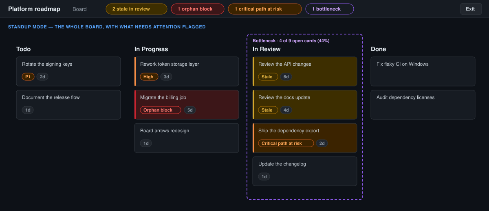

# Standup mode

On a GitHub Projects **Board** (kanban) view, adds a **Standup** button to the view-tabs bar that turns the board into a temporary, screen-sharing-friendly presentation: it reclaims the viewport, enlarges column headings and cards for legibility, and spotlights one card at a time in the board's own order, with keyboard and on-screen controls.

On by default; switchable from Settings. The button only appears on Board views — switch to a Table or Roadmap view and it withdraws itself.

_Mockup illustrating the layout — not a literal screenshot._

## What it does

- Adds a **Standup** button to the view-tabs bar, shown only while a Board view is selected (including after switching to a Board view without a full page reload). It sits to the left of the Board dependency arrows switch so the two never overlap.
- Entering reclaims the viewport — hides GitHub's global top chrome, enlarges column headings and card text — while keeping the board's columns and their current order recognizable. When the Full-width board feature is off it also stretches the board to the window width; when that feature is on, it leaves the width to it so the two don't fight.
- Spotlights one card at a time: everything but the current card is dimmed, the current card is ringed and scrolled into view, and a panel shows its title (linking to the issue), its column/status, and its assignee when those are available.
- Walks the cards in their visible board order — columns left → right, cards top → bottom — with the keyboard (`→`/`↓`/`Space`/`PageDown` for next, `←`/`↑`/`PageUp` for previous, `Home`/`End` for first/last) and with the panel's **Prev**/**Next** buttons.
- Exits with the **Exit** button, the same keyboard `Esc`, or by navigating away from the Board view, restoring the pre-entry scroll position and focus as reasonably as possible.

## Design notes

- **Read-only and local.** The mode only adds an overlay and some CSS classes — it never mutates issues, Project fields, or card order, and makes no extra GitHub API call or permission request. The "currently presenting" state lives in memory only (never in `chrome.storage`), so it stays local to the tab and never survives a reload or leaks to other tabs. Only the feature's on/off switch is stored, shared with the Settings toggle.
- **No stale highlights.** The spotlight is recomputed on scroll, resize, and any board mutation (filtering, dynamically loaded cards); the current card is tracked by its issue identity so the spotlight follows it across re-renders and clamps to a valid card when it disappears. Exiting clears every mark it added.
- **No browser Fullscreen API.** The mode works purely by reclaiming the page's own viewport; invoking the browser's Fullscreen API is left as a possible later enhancement.

## Known limitations

- Card order follows the board's DOM order (columns left → right, cards top → bottom), which matches the visible order; a board that renders cards out of visual order would be walked in that DOM order.
- Assignee is read from a card's avatar `alt`/`aria-label` text when present, and the column name from the column's heading text — both degrade to "not shown" rather than guessing when GitHub's markup doesn't expose them.
- Like the other board features, it anchors on class-name prefixes read off a live board's DOM (`Board-module__boardContainer`, `board-view-column`, `view-navigation-module__ViewNavigationContainer`); GitHub's Projects app doesn't publish stable class names, but the un-hashed prefixes have been stable across the redesigns checked so far.
